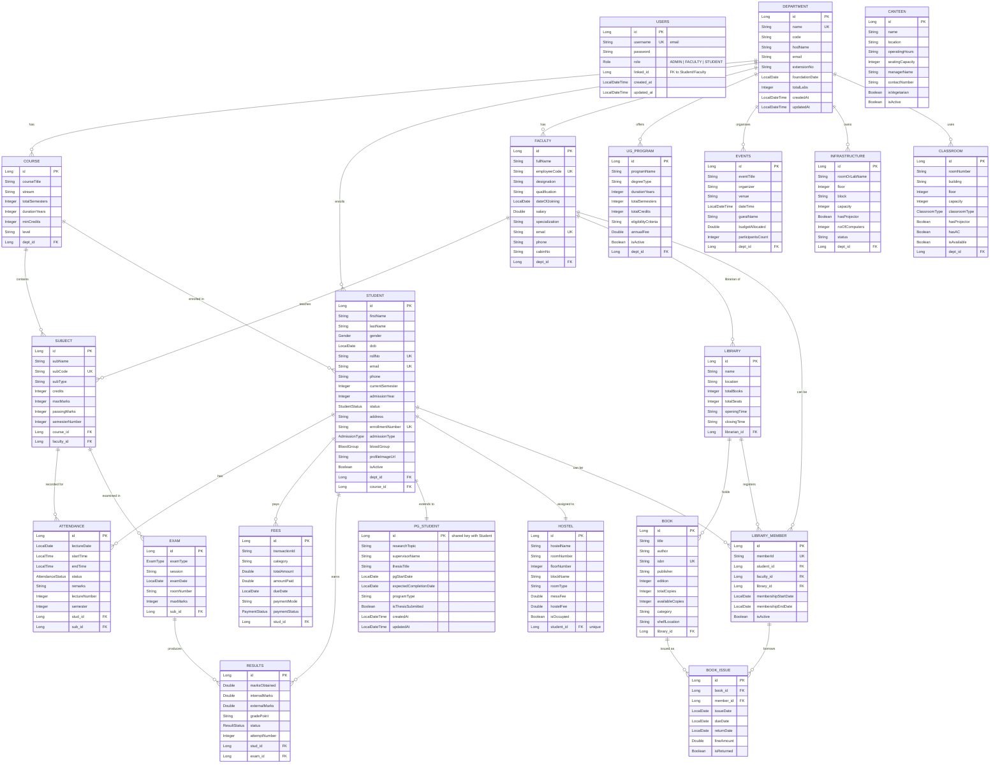

# College Management System — Backend API Documentation

> **Base URL**: `http://localhost:8080`
> **Database**: PostgreSQL (`cms` on `localhost:5432`)
> **Auth**: JWT Bearer Token (HS256, 1 hour expiry)
> **CORS**: Allowed origin `http://localhost:4200`

---

## Table of Contents

1. [ER Diagram](#1-er-diagram)
2. [Relationship Analysis](#2-relationship-analysis)
3. [Enum Reference](#3-enum-reference)
4. [Authentication API](#4-authentication-api)
5. [Error Response Format](#5-error-response-format)
6. [Security Rules](#6-security-rules)
7. [API Endpoints — Full Reference](#7-api-endpoints--full-reference)
   - [Department](#71-department)
   - [Course](#72-course)
   - [Subject](#73-subject)
   - [Student](#74-student)
   - [Faculty](#75-faculty)
   - [Attendance](#76-attendance)
   - [Exam](#77-exam)
   - [Results](#78-results)
   - [Fees](#79-fees)
   - [UG Program](#710-ug-program)
   - [PG Student](#711-pg-student)
   - [Hostel](#712-hostel)
   - [Library](#713-library)
   - [Library Member](#714-library-member)
   - [Book](#715-book)
   - [Book Issue](#716-book-issue)
   - [Canteen](#717-canteen)
   - [Classroom](#718-classroom)
   - [Events](#719-events)
   - [Infrastructure](#720-infrastructure)
8. [API URL Cheat Sheet](#8-api-url-cheat-sheet)

---

## 1. ER Diagram



---

## 2. Relationship Analysis

### ✅ All Relationships Verified

| Relationship | Type | Status |
|---|---|---|
| Department → Student | OneToMany (dept_id) | ✅ |
| Department → Course | OneToMany (dept_id) | ✅ |
| Department → Faculty | OneToMany (dept_id) | ✅ |
| Department → UGProgram | OneToMany (dept_id) | ✅ |
| Department → Events | ManyToOne (dept_id) | ✅ |
| Department → Infrastructure | ManyToOne (dept_id) | ✅ |
| Department → Classroom | ManyToOne (dept_id, nullable) | ✅ |
| Course → Subject | OneToMany (course_id) | ✅ |
| Course → Department | ManyToOne (dept_id) | ✅ |
| Student → Department | ManyToOne (dept_id) | ✅ |
| Student → Course | ManyToOne (course_id) | ✅ |
| Student → Attendance | OneToMany | ✅ |
| Student → Fees | OneToMany | ✅ |
| Student → Results | OneToMany | ✅ |
| Student ↔ PGStudent | OneToOne (@MapsId, extends BaseEntity) | ✅ |
| Student ↔ Hostel | OneToOne (unique student_id) | ✅ |
| Faculty → Subject | OneToMany (faculty_id) | ✅ |
| Subject → Attendance | ManyToOne (sub_id) | ✅ |
| Subject → Exam | ManyToOne (sub_id) | ✅ |
| Exam → Results | OneToMany (exam_id) | ✅ |
| Library → Book | OneToMany (library_id) | ✅ |
| Library → Faculty (librarian) | ManyToOne (librarian_id, nullable) | ✅ |
| LibraryMember → Student | ManyToOne (nullable) | ✅ |
| LibraryMember → Faculty | ManyToOne (nullable) | ✅ |
| LibraryMember → Library | ManyToOne | ✅ |
| BookIssue → Book | ManyToOne | ✅ |
| BookIssue → LibraryMember | ManyToOne | ✅ |

### Notes

| # | Note | Details |
|---|---|---|
| 1 | **Canteen is standalone** | No FK relationships — fully independent master-data table. |
| 2 | **Attendance unique constraint** | Unique on `(stud_id, sub_id, lectureDate, lectureNumber)` — supports multiple lectures of the same subject on the same day. |
| 3 | **Results unique constraint** | Unique on `(stud_id, exam_id)` — one result per student per exam. |
| 4 | **PGStudent extends BaseEntity** | Shares primary key with Student via `@MapsId`, inherits `createdAt`/`updatedAt` audit fields. |

---

## 3. Enum Reference

### Gender
```
MALE | FEMALE | OTHER
```

### StudentStatus
```
ACTIVE | INACTIVE | GRADUATED | DROPPED
```

### AdmissionType
```
REGULAR | LATERAL | MANAGEMENT | NRI | SCHOLARSHIP
```

### BloodGroup
```
A_POSITIVE | A_NEGATIVE | B_POSITIVE | B_NEGATIVE | O_POSITIVE | O_NEGATIVE | AB_POSITIVE | AB_NEGATIVE
```

### AttendanceStatus
```
PRESENT | ABSENT | MEDICAL_LEAVE
```

### ClassroomType
```
LECTURE_HALL | LABORATORY | SEMINAR_ROOM | COMPUTER_LAB | WORKSHOP | AUDITORIUM
```

### ExamType
```
MIDTERM | ENDTERM | PRACTICAL
```

### PaymentStatus
```
PAID | PENDING | FAILED
```

### ResultStatus
```
PASS | FAIL | ATKT
```

### Grade
```
A_PLUS | A | B_PLUS | B | C_PLUS | C | D | F | INCOMPLETE | WITHDRAWN
```

### Role (Security)
```
ADMIN | FACULTY | STUDENT
```

---

## 4. Authentication API

### 4.1 Signup — `POST /api/auth/signup`

> **Auth Required**: No

**Request Body:**
```json
{
  "username": "admin@college.edu",
  "password": "secret123",
  "role": "ADMIN",
  "linkedId": null
}
```

| Field | Type | Validation | Required |
|---|---|---|---|
| `username` | String | `@Email`, `@NotBlank` | ✅ |
| `password` | String | `@NotBlank`, min 6 chars | ✅ |
| `role` | String (enum) | `ADMIN`, `FACULTY`, `STUDENT` | ✅ |
| `linkedId` | Long | Optional FK to Student/Faculty | ❌ |

**Response (201):**
```json
{
  "token": "eyJhbGciOiJIUzI1NiJ9...",
  "type": "Bearer",
  "username": "admin@college.edu",
  "role": "ADMIN"
}
```

### 4.2 Login — `POST /api/auth/login`

> **Auth Required**: No

**Request Body:**
```json
{
  "username": "admin@college.edu",
  "password": "secret123"
}
```

| Field | Type | Validation | Required |
|---|---|---|---|
| `username` | String | `@NotBlank` | ✅ |
| `password` | String | `@NotBlank` | ✅ |

**Response (200):**
```json
{
  "token": "eyJhbGciOiJIUzI1NiJ9...",
  "type": "Bearer",
  "username": "admin@college.edu",
  "role": "ADMIN"
}
```

### How to use the JWT Token
For all protected endpoints (POST, PUT, PATCH, DELETE), add this header:
```
Authorization: Bearer <token>
```

---

## 5. Error Response Format

All errors follow this consistent JSON structure:

```json
{
  "timestamp": "2026-04-11T20:30:00",
  "status": 404,
  "error": "NOT_FOUND",
  "message": "Student not found with id: 999",
  "path": "/api/students/999"
}
```

| HTTP Status | Error Code | When |
|---|---|---|
| 400 | `BAD_REQUEST` | Validation errors, constraint violations |
| 401 | `UNAUTHORIZED` | Bad credentials, expired/invalid JWT |
| 403 | `FORBIDDEN` | Access denied (wrong role) |
| 404 | `NOT_FOUND` | Resource not found |
| 409 | `CONFLICT` | User already exists (signup) |
| 500 | `INTERNAL_SERVER_ERROR` | Unexpected errors |

---

## 6. Security Rules

> All URLs are standardized under `/api/` prefix.

| Method | URL Pattern | Auth Required? |
|---|---|---|
| ANY | `/api/auth/**` | ❌ Public |
| GET | `/api/**` | ❌ Public |
| POST/PUT/PATCH/DELETE | `/api/**` | ✅ JWT Required |

---

## 7. API Endpoints — Full Reference

> All endpoints use the standardized `/api/` prefix.

---

### 7.1 Department

**Base URL**: `/api/departments`

#### Create — `POST /api/departments`
> Auth: ✅ JWT Required

**Request:**
```json
{
  "name": "Computer Science",
  "code": "CS",
  "hodName": "Dr. Sharma",
  "email": "cs@college.edu",
  "extensionNo": "101"
}
```

| Field | Type | Required |
|---|---|---|
| `name` | String | ✅ (`@NotBlank`) |
| `code` | String | ❌ |
| `hodName` | String | ❌ |
| `email` | String | ❌ |
| `extensionNo` | String | ❌ |

**Response (200):**
```json
{
  "id": 1,
  "name": "Computer Science",
  "code": "CS",
  "hodName": "Dr. Sharma",
  "email": "cs@college.edu"
}
```

#### Other endpoints:
- `GET /api/departments/{id}` → DepartmentResponseDTO (200)
- `GET /api/departments` → List (200)
- `PUT /api/departments/{id}` → DepartmentResponseDTO (200)
- `PATCH /api/departments/{id}` → DepartmentResponseDTO (200)
- `DELETE /api/departments/{id}` → 204

---

### 7.2 Course

**Base URL**: `/api/courses`

#### Create — `POST /api/courses`
> Auth: ✅ JWT Required

**Request:**
```json
{
  "courseTitle": "B.Tech Computer Science",
  "stream": "Engineering",
  "totalSemesters": 8,
  "durationYears": 4,
  "minCredits": 160,
  "level": "UG",
  "departmentId": 1
}
```

| Field | Type | Required |
|---|---|---|
| `courseTitle` | String | ✅ (`@NotBlank`) |
| `stream` | String | ❌ |
| `totalSemesters` | Integer | ✅ (`@NotNull`) |
| `durationYears` | Integer | ❌ |
| `minCredits` | Integer | ❌ |
| `level` | String | ❌ |
| `departmentId` | Long | ✅ (`@NotNull`) |

**Response (200):**
```json
{
  "id": 1,
  "courseTitle": "B.Tech Computer Science",
  "stream": "Engineering",
  "totalSemesters": 8,
  "departmentName": "Computer Science"
}
```

#### Other endpoints:
- `GET /api/courses/{id}` → CourseResponseDTO (200)
- `GET /api/courses` → List (200)
- `PUT /api/courses/{id}` → CourseResponseDTO (200)
- `PATCH /api/courses/{id}` → CourseResponseDTO (200)
- `DELETE /api/courses/{id}` → 204

---

### 7.3 Subject

**Base URL**: `/api/subjects`

#### Create — `POST /api/subjects`
> Auth: ✅ JWT Required

**Request:**
```json
{
  "subName": "Data Structures",
  "subCode": "CS301",
  "subType": "Theory",
  "credits": 4,
  "maxMarks": 100,
  "passingMarks": 40,
  "semesterNumber": 3,
  "courseId": 1,
  "facultyId": 1
}
```

| Field | Type | Required |
|---|---|---|
| `subName` | String | ✅ (`@NotBlank`) |
| `subCode` | String | ✅ (`@NotBlank`) |
| `subType` | String | ❌ |
| `credits` | Integer | ✅ (`@NotNull`) |
| `maxMarks` | Integer | ❌ |
| `passingMarks` | Integer | ❌ |
| `semesterNumber` | Integer | ✅ (`@NotNull`) |
| `courseId` | Long | ✅ (`@NotNull`) |
| `facultyId` | Long | ✅ (`@NotNull`) |

**Response (200):**
```json
{
  "id": 1,
  "subName": "Data Structures",
  "subCode": "CS301",
  "credits": 4,
  "courseName": "B.Tech Computer Science",
  "facultyName": "Dr. Sharma"
}
```

#### Other endpoints:
- `GET /api/subjects/{id}` → SubjectResponseDTO (200)
- `GET /api/subjects` → List (200)
- `PUT /api/subjects/{id}` → SubjectResponseDTO (200)
- `PATCH /api/subjects/{id}` → SubjectResponseDTO (200)
- `DELETE /api/subjects/{id}` → 204

---

### 7.4 Student

**Base URL**: `/api/students`

#### Create — `POST /api/students`
> Auth: ✅ JWT Required

**Request:**
```json
{
  "firstName": "Ayush",
  "lastName": "Dubey",
  "gender": "MALE",
  "dob": "2003-05-15",
  "rollNo": "21CS001",
  "email": "ayush@college.edu",
  "phone": "9876543210",
  "currentSemester": 6,
  "admissionYear": 2021,
  "status": "ACTIVE",
  "address": "Bhopal, MP",
  "enrollmentNumber": "EN2021CS001",
  "admissionType": "REGULAR",
  "bloodGroup": "B_POSITIVE",
  "profileImageUrl": "https://example.com/photo.jpg",
  "departmentId": 1,
  "courseId": 1
}
```

| Field | Type | Required |
|---|---|---|
| `firstName` | String | ✅ (`@NotBlank`) |
| `lastName` | String | ❌ |
| `gender` | String (enum) | ✅ (`@NotNull`) — `MALE/FEMALE/OTHER` |
| `dob` | String (date) | ❌ — format `YYYY-MM-DD` |
| `rollNo` | String | ✅ (`@NotBlank`) |
| `email` | String | ❌ (`@Email`) |
| `phone` | String | ❌ |
| `currentSemester` | Integer | ✅ (`@NotNull`) |
| `admissionYear` | Integer | ✅ (`@NotNull`) |
| `status` | String (enum) | ✅ (`@NotNull`) — `ACTIVE/INACTIVE/GRADUATED/DROPPED` |
| `address` | String | ❌ |
| `enrollmentNumber` | String | ❌ (unique) |
| `admissionType` | String (enum) | ❌ — `REGULAR/LATERAL/MANAGEMENT/NRI/SCHOLARSHIP` |
| `bloodGroup` | String (enum) | ❌ — see BloodGroup enum |
| `profileImageUrl` | String | ❌ |
| `departmentId` | Long | ✅ (`@NotNull`) |
| `courseId` | Long | ✅ (`@NotNull`) |

**Response (201):**
```json
{
  "id": 1,
  "firstName": "Ayush",
  "lastName": "Dubey",
  "gender": "MALE",
  "dob": "2003-05-15",
  "rollNo": "21CS001",
  "email": "ayush@college.edu",
  "phone": "9876543210",
  "currentSemester": 6,
  "admissionYear": 2021,
  "status": "ACTIVE",
  "address": "Bhopal, MP",
  "enrollmentNumber": "EN2021CS001",
  "admissionType": "REGULAR",
  "bloodGroup": "B_POSITIVE",
  "profileImageUrl": "https://example.com/photo.jpg",
  "isActive": true,
  "departmentName": "Computer Science",
  "courseName": "B.Tech Computer Science"
}
```

#### Other endpoints:
- `GET /api/students/{id}` → StudentResponseDTO (200)
- `GET /api/students` → List (200)
- `PUT /api/students/{id}` → StudentResponseDTO (200) — full update, all required fields
- `PATCH /api/students/{id}` → StudentResponseDTO (200) — partial update, only non-null fields
- `DELETE /api/students/{id}` → 204

---

### 7.5 Faculty

**Base URL**: `/api/faculty`

#### Create — `POST /api/faculty`
> Auth: ✅ JWT Required

**Request:**
```json
{
  "fullName": "Dr. Rajesh Sharma",
  "employeeCode": "FAC001",
  "designation": "Professor",
  "qualification": "PhD Computer Science",
  "dateOfJoining": "2015-07-01",
  "salary": 120000.0,
  "specialization": "Artificial Intelligence",
  "email": "rajesh@college.edu",
  "phone": "9876543210",
  "cabinNo": "CS-205",
  "departmentId": 1
}
```

| Field | Type | Required |
|---|---|---|
| `fullName` | String | ✅ (`@NotBlank`) |
| `employeeCode` | String | ❌ (unique) |
| `designation` | String | ❌ |
| `qualification` | String | ❌ |
| `dateOfJoining` | String (date) | ❌ — `YYYY-MM-DD` |
| `salary` | Double | ❌ |
| `specialization` | String | ❌ |
| `email` | String | ❌ (`@Email`, unique) |
| `phone` | String | ❌ |
| `cabinNo` | String | ❌ |
| `departmentId` | Long | ✅ (`@NotNull`) |

**Response (201):**
```json
{
  "id": 1,
  "fullName": "Dr. Rajesh Sharma",
  "employeeCode": "FAC001",
  "designation": "Professor",
  "qualification": "PhD Computer Science",
  "dateOfJoining": "2015-07-01",
  "salary": 120000.0,
  "specialization": "Artificial Intelligence",
  "email": "rajesh@college.edu",
  "phone": "9876543210",
  "cabinNo": "CS-205",
  "departmentName": "Computer Science"
}
```

#### Other endpoints:
- `GET /api/faculty/{id}` → FacultyResponseDTO (200)
- `GET /api/faculty` → List (200)
- `PUT /api/faculty/{id}` → FacultyResponseDTO (200)
- `DELETE /api/faculty/{id}` → 204

---

### 7.6 Attendance

**Base URL**: `/api/attendance`

#### Create — `POST /api/attendance`
> Auth: ✅ JWT Required

**Request:**
```json
{
  "lectureDate": "2026-04-11",
  "startTime": "09:00:00",
  "endTime": "10:00:00",
  "status": "PRESENT",
  "remarks": null,
  "lectureNumber": 1,
  "semester": 6,
  "studentId": 1,
  "subjectId": 1
}
```

| Field | Type | Required |
|---|---|---|
| `lectureDate` | String (date) | ✅ (`@NotNull`) — `YYYY-MM-DD` |
| `startTime` | String (time) | ❌ — `HH:mm:ss` |
| `endTime` | String (time) | ❌ — `HH:mm:ss` |
| `status` | String (enum) | ✅ (`@NotNull`) — `PRESENT/ABSENT/MEDICAL_LEAVE` |
| `remarks` | String | ❌ |
| `lectureNumber` | Integer | ✅ (`@NotNull`) |
| `semester` | Integer | ✅ (`@NotNull`) |
| `studentId` | Long | ✅ (`@NotNull`) |
| `subjectId` | Long | ✅ (`@NotNull`) |

**Response (201):**
```json
{
  "id": 1,
  "lectureDate": "2026-04-11",
  "startTime": "09:00:00",
  "endTime": "10:00:00",
  "status": "PRESENT",
  "remarks": null,
  "lectureNumber": 1,
  "semester": 6,
  "studentName": "Ayush Dubey",
  "studentRollNo": "21CS001",
  "subjectName": "Data Structures",
  "subjectCode": "CS301"
}
```

#### Other endpoints:
- `GET /api/attendance/{id}` → AttendanceResponseDTO (200)
- `GET /api/attendance` → List (200)
- `PUT /api/attendance/{id}` → AttendanceResponseDTO (200)
- `DELETE /api/attendance/{id}` → 204

#### Get Subject Percentage — `GET /api/attendance/student/{studentId}/subject/{subjectId}`
> Auth: ❌

**Response (200):**
```json
{
  "studentId": 1,
  "subjectId": 1,
  "percentage": 85.0,
  "totalClasses": 40,
  "attendedClasses": 34
}
```

---

### 7.7 Exam

**Base URL**: `/api/exams`

#### Create — `POST /api/exams`
> Auth: ✅ JWT Required

**Request:**
```json
{
  "examType": "MIDTERM",
  "session": "2024-25",
  "examDate": "2025-03-15",
  "roomNumber": "Hall-1",
  "maxMarks": 100,
  "subjectId": 1
}
```

| Field | Type | Required |
|---|---|---|
| `examType` | String (enum) | ✅ (`@NotNull`) — `MIDTERM/ENDTERM/PRACTICAL` |
| `session` | String | ❌ |
| `examDate` | String (date) | ✅ (`@NotNull`) — `YYYY-MM-DD` |
| `roomNumber` | String | ❌ |
| `maxMarks` | Integer | ❌ |
| `subjectId` | Long | ✅ (`@NotNull`) |

**Response (201):**
```json
{
  "id": 1,
  "examType": "MIDTERM",
  "session": "2024-25",
  "examDate": "2025-03-15",
  "roomNumber": "Hall-1",
  "maxMarks": 100,
  "subjectName": "Data Structures",
  "subjectCode": "CS301"
}
```

#### Other endpoints:
- `GET /api/exams/{id}` → ExamResponseDTO (200)
- `GET /api/exams` → List (200)
- `PUT /api/exams/{id}` → ExamResponseDTO (200)
- `DELETE /api/exams/{id}` → 204

---

### 7.8 Results

**Base URL**: `/api/results`

#### Create — `POST /api/results`
> Auth: ✅ JWT Required

**Request:**
```json
{
  "marksObtained": 85.5,
  "internalMarks": 28.0,
  "externalMarks": 57.5,
  "gradePoint": "9.0",
  "status": "PASS",
  "attemptNumber": 1,
  "studentId": 1,
  "examId": 1
}
```

| Field | Type | Required |
|---|---|---|
| `marksObtained` | Double | ✅ (`@NotNull`) |
| `internalMarks` | Double | ❌ |
| `externalMarks` | Double | ❌ |
| `gradePoint` | String | ❌ |
| `status` | String (enum) | ✅ (`@NotNull`) — `PASS/FAIL/ATKT` |
| `attemptNumber` | Integer | ❌ |
| `studentId` | Long | ✅ (`@NotNull`) |
| `examId` | Long | ✅ (`@NotNull`) |

**Response (201):**
```json
{
  "id": 1,
  "marksObtained": 85.5,
  "internalMarks": 28.0,
  "externalMarks": 57.5,
  "gradePoint": "9.0",
  "status": "PASS",
  "attemptNumber": 1,
  "studentName": "Ayush Dubey",
  "studentRollNo": "21CS001",
  "examSession": "2024-25",
  "subjectName": "Data Structures"
}
```

#### Other endpoints:
- `GET /api/results/{id}` → ResultsResponseDTO (200)
- `GET /api/results` → List (200)
- `PUT /api/results/{id}` → ResultsResponseDTO (200)
- `DELETE /api/results/{id}` → 204

---

### 7.9 Fees

**Base URL**: `/api/fees`

#### Create — `POST /api/fees`
> Auth: ✅ JWT Required

**Request:**
```json
{
  "transactionId": "TXN-2024-001",
  "category": "Tuition",
  "totalAmount": 75000.0,
  "amountPaid": 75000.0,
  "dueDate": "2025-06-30",
  "paymentMode": "Online",
  "paymentStatus": "PAID",
  "studentId": 1
}
```

| Field | Type | Required |
|---|---|---|
| `transactionId` | String | ❌ |
| `category` | String | ❌ |
| `totalAmount` | Double | ✅ (`@NotNull`) |
| `amountPaid` | Double | ❌ |
| `dueDate` | String (date) | ❌ — `YYYY-MM-DD` |
| `paymentMode` | String | ❌ |
| `paymentStatus` | String (enum) | ✅ (`@NotNull`) — `PAID/PENDING/FAILED` |
| `studentId` | Long | ✅ (`@NotNull`) |

**Response (201):**
```json
{
  "id": 1,
  "transactionId": "TXN-2024-001",
  "category": "Tuition",
  "totalAmount": 75000.0,
  "amountPaid": 75000.0,
  "dueDate": "2025-06-30",
  "paymentMode": "Online",
  "paymentStatus": "PAID",
  "studentName": "Ayush Dubey",
  "studentRollNo": "21CS001"
}
```

#### Other endpoints:
- `GET /api/fees/{id}` → FeesResponseDTO (200)
- `GET /api/fees` → List (200)
- `PUT /api/fees/{id}` → FeesResponseDTO (200)
- `DELETE /api/fees/{id}` → 204

---

### 7.10 UG Program

**Base URL**: `/api/ug-programs`

#### Create — `POST /api/ug-programs`
> Auth: ✅ JWT Required

**Request:**
```json
{
  "programName": "Bachelor of Technology",
  "degreeType": "B.Tech",
  "durationYears": 4,
  "totalSemesters": 8,
  "totalCredits": 160,
  "eligibilityCriteria": "10+2 with PCM, min 60%",
  "annualFee": 150000.0,
  "isActive": true,
  "departmentId": 1
}
```

| Field | Type | Required |
|---|---|---|
| `programName` | String | ✅ (`@NotBlank`) |
| `degreeType` | String | ❌ |
| `durationYears` | Integer | ❌ |
| `totalSemesters` | Integer | ❌ |
| `totalCredits` | Integer | ❌ |
| `eligibilityCriteria` | String | ❌ |
| `annualFee` | Double | ❌ |
| `isActive` | Boolean | ❌ |
| `departmentId` | Long | ✅ (`@NotNull`) |

**Response (201):**
```json
{
  "id": 1,
  "programName": "Bachelor of Technology",
  "degreeType": "B.Tech",
  "durationYears": 4,
  "totalSemesters": 8,
  "totalCredits": 160,
  "eligibilityCriteria": "10+2 with PCM, min 60%",
  "annualFee": 150000.0,
  "isActive": true,
  "departmentName": "Computer Science"
}
```

#### Other endpoints:
- `GET /api/ug-programs/{id}` → UGProgramResponseDTO (200)
- `GET /api/ug-programs` → List (200)
- `PUT /api/ug-programs/{id}` → UGProgramResponseDTO (200)
- `DELETE /api/ug-programs/{id}` → 204

---

### 7.11 PG Student

**Base URL**: `/api/pg-students`

#### Create — `POST /api/pg-students`
> Auth: ✅ JWT Required

**Request:**
```json
{
  "studentId": 5,
  "researchTopic": "Deep Learning for NLP",
  "supervisorName": "Dr. Amit Jain",
  "thesisTitle": "Transformer-based Language Models",
  "pgStartDate": "2024-07-01",
  "expectedCompletionDate": "2026-06-30",
  "programType": "M.Tech",
  "isThesisSubmitted": false
}
```

| Field | Type | Required |
|---|---|---|
| `studentId` | Long | ✅ (`@NotNull`) |
| `researchTopic` | String | ✅ (`@NotBlank`) |
| `supervisorName` | String | ❌ |
| `thesisTitle` | String | ❌ |
| `pgStartDate` | String (date) | ❌ — `YYYY-MM-DD` |
| `expectedCompletionDate` | String (date) | ❌ |
| `programType` | String | ❌ |
| `isThesisSubmitted` | Boolean | ❌ |

**Response (201):**
```json
{
  "id": 5,
  "studentName": "Ayush Dubey",
  "rollNo": "21CS005",
  "researchTopic": "Deep Learning for NLP",
  "supervisorName": "Dr. Amit Jain",
  "thesisTitle": "Transformer-based Language Models",
  "pgStartDate": "2024-07-01",
  "expectedCompletionDate": "2026-06-30",
  "programType": "M.Tech",
  "isThesisSubmitted": false
}
```

#### Other endpoints:
- `GET /api/pg-students/{id}` → PGStudentResponseDTO (200)
- `GET /api/pg-students` → List (200)
- `PUT /api/pg-students/{id}` → PGStudentResponseDTO (200)
- `DELETE /api/pg-students/{id}` → 204

---

### 7.12 Hostel

**Base URL**: `/api/hostel`

#### Create — `POST /api/hostel`
> Auth: ✅ JWT Required

**Request:**
```json
{
  "hostelName": "Boys Hostel A",
  "roomNumber": "A-101",
  "floorNumber": 1,
  "blockName": "Block A",
  "roomType": "Double",
  "messFee": 3500.0,
  "hostelFee": 12000.0,
  "isOccupied": true,
  "studentId": 1
}
```

| Field | Type | Required |
|---|---|---|
| `hostelName` | String | ✅ (`@NotBlank`) |
| `roomNumber` | String | ❌ |
| `floorNumber` | Integer | ❌ |
| `blockName` | String | ❌ |
| `roomType` | String | ❌ — `Single/Double/Triple` |
| `messFee` | Double | ❌ |
| `hostelFee` | Double | ❌ |
| `isOccupied` | Boolean | ❌ |
| `studentId` | Long | ❌ (nullable) |

**Response (201):**
```json
{
  "id": 1,
  "hostelName": "Boys Hostel A",
  "roomNumber": "A-101",
  "floorNumber": 1,
  "blockName": "Block A",
  "roomType": "Double",
  "messFee": 3500.0,
  "hostelFee": 12000.0,
  "isOccupied": true,
  "studentName": "Ayush Dubey",
  "studentRollNo": "21CS001"
}
```

#### Other endpoints:
- `GET /api/hostel/{id}` → HostelResponseDTO (200)
- `GET /api/hostel` → List (200)
- `PUT /api/hostel/{id}` → HostelResponseDTO (200)
- `DELETE /api/hostel/{id}` → 204

---

### 7.13 Library

**Base URL**: `/api/libraries`

#### Create — `POST /api/libraries`
> Auth: ✅ JWT Required

**Request:**
```json
{
  "name": "Central Library",
  "location": "Main Building, Ground Floor",
  "totalBooks": 50000,
  "totalSeats": 200,
  "openingTime": "08:00",
  "closingTime": "20:00",
  "librarianId": 1
}
```

| Field | Type | Required |
|---|---|---|
| `name` | String | ✅ (`@NotBlank`) |
| `location` | String | ❌ |
| `totalBooks` | Integer | ❌ |
| `totalSeats` | Integer | ❌ |
| `openingTime` | String | ❌ |
| `closingTime` | String | ❌ |
| `librarianId` | Long | ❌ (FK to Faculty) |

**Response (201):**
```json
{
  "id": 1,
  "name": "Central Library",
  "location": "Main Building, Ground Floor",
  "totalBooks": 50000,
  "totalSeats": 200,
  "openingTime": "08:00",
  "closingTime": "20:00",
  "librarianName": "Dr. Sharma"
}
```

#### Other endpoints:
- `GET /api/libraries/{id}` → LibraryResponseDTO (200)
- `GET /api/libraries` → List (200)
- `PUT /api/libraries/{id}` → LibraryResponseDTO (200)
- `DELETE /api/libraries/{id}` → 204

---

### 7.14 Library Member

**Base URL**: `/api/library-members`

#### Create — `POST /api/library-members`
> Auth: ✅ JWT Required

**Request:**
```json
{
  "memberId": "LIB-2024-001",
  "studentId": 1,
  "facultyId": null,
  "libraryId": 1,
  "membershipStartDate": "2024-07-01",
  "membershipEndDate": "2025-06-30",
  "isActive": true
}
```

| Field | Type | Required |
|---|---|---|
| `memberId` | String | ✅ (`@NotBlank`) |
| `studentId` | Long | ❌ (one of student/faculty) |
| `facultyId` | Long | ❌ (one of student/faculty) |
| `libraryId` | Long | ✅ (`@NotNull`) |
| `membershipStartDate` | String (date) | ❌ |
| `membershipEndDate` | String (date) | ❌ |
| `isActive` | Boolean | ❌ |

**Response (201):**
```json
{
  "id": 1,
  "memberId": "LIB-2024-001",
  "memberName": "Ayush Dubey",
  "memberType": "STUDENT",
  "libraryName": "Central Library",
  "membershipStartDate": "2024-07-01",
  "membershipEndDate": "2025-06-30",
  "isActive": true
}
```

#### Other endpoints:
- `GET /api/library-members/{id}` → LibraryMemberResponseDTO (200)
- `GET /api/library-members` → List (200)
- `PUT /api/library-members/{id}` → LibraryMemberResponseDTO (200)
- `DELETE /api/library-members/{id}` → 204

---

### 7.15 Book

**Base URL**: `/api/books`

#### Create — `POST /api/books`
> Auth: ✅ JWT Required

**Request:**
```json
{
  "title": "Introduction to Algorithms",
  "author": "Thomas H. Cormen",
  "isbn": "978-0262033848",
  "publisher": "MIT Press",
  "edition": 3,
  "totalCopies": 10,
  "availableCopies": 8,
  "category": "Computer Science",
  "shelfLocation": "CS-A3-12",
  "libraryId": 1
}
```

| Field | Type | Required |
|---|---|---|
| `title` | String | ✅ (`@NotBlank`) |
| `author` | String | ❌ |
| `isbn` | String | ✅ (`@NotBlank`) |
| `publisher` | String | ❌ |
| `edition` | Integer | ❌ |
| `totalCopies` | Integer | ❌ |
| `availableCopies` | Integer | ❌ |
| `category` | String | ❌ |
| `shelfLocation` | String | ❌ |
| `libraryId` | Long | ✅ (`@NotNull`) |

**Response (201):**
```json
{
  "id": 1,
  "title": "Introduction to Algorithms",
  "author": "Thomas H. Cormen",
  "isbn": "978-0262033848",
  "publisher": "MIT Press",
  "edition": 3,
  "totalCopies": 10,
  "availableCopies": 8,
  "category": "Computer Science",
  "shelfLocation": "CS-A3-12",
  "libraryName": "Central Library"
}
```

#### Other endpoints:
- `GET /api/books/{id}` → BookResponseDTO (200)
- `GET /api/books` → List (200)
- `PUT /api/books/{id}` → BookResponseDTO (200)
- `DELETE /api/books/{id}` → 204

---

### 7.16 Book Issue

**Base URL**: `/api/book-issues`

#### Create — `POST /api/book-issues`
> Auth: ✅ JWT Required

**Request:**
```json
{
  "bookId": 1,
  "memberId": 1,
  "issueDate": "2024-09-01",
  "dueDate": "2024-09-15",
  "returnDate": null,
  "fineAmount": null,
  "isReturned": false
}
```

| Field | Type | Required |
|---|---|---|
| `bookId` | Long | ✅ (`@NotNull`) |
| `memberId` | Long | ✅ (`@NotNull`) |
| `issueDate` | String (date) | ✅ (`@NotNull`) |
| `dueDate` | String (date) | ✅ (`@NotNull`) |
| `returnDate` | String (date) | ❌ |
| `fineAmount` | Double | ❌ |
| `isReturned` | Boolean | ❌ |

**Response (201):**
```json
{
  "id": 1,
  "bookTitle": "Introduction to Algorithms",
  "memberName": "Ayush Dubey",
  "issueDate": "2024-09-01",
  "dueDate": "2024-09-15",
  "returnDate": null,
  "fineAmount": null,
  "isReturned": false
}
```

#### Other endpoints:
- `GET /api/book-issues/{id}` → BookIssueResponseDTO (200)
- `GET /api/book-issues` → List (200)
- `PUT /api/book-issues/{id}` → BookIssueResponseDTO (200)
- `DELETE /api/book-issues/{id}` → 204

---

### 7.17 Canteen

**Base URL**: `/api/canteens`

#### Create — `POST /api/canteens`
> Auth: ✅ JWT Required

**Request:**
```json
{
  "name": "Main Canteen",
  "location": "Student Center",
  "operatingHours": "8:00 AM - 8:00 PM",
  "seatingCapacity": 200,
  "managerName": "Ramesh Gupta",
  "contactNumber": "9876543210",
  "isVegetarian": false,
  "isActive": true
}
```

| Field | Type | Required |
|---|---|---|
| `name` | String | ✅ (`@NotBlank`) |
| `location` | String | ❌ |
| `operatingHours` | String | ❌ |
| `seatingCapacity` | Integer | ❌ |
| `managerName` | String | ❌ |
| `contactNumber` | String | ❌ |
| `isVegetarian` | Boolean | ❌ |
| `isActive` | Boolean | ❌ |

**Response (201):**
```json
{
  "id": 1,
  "name": "Main Canteen",
  "location": "Student Center",
  "operatingHours": "8:00 AM - 8:00 PM",
  "seatingCapacity": 200,
  "managerName": "Ramesh Gupta",
  "contactNumber": "9876543210",
  "isVegetarian": false,
  "isActive": true
}
```

#### Other endpoints:
- `GET /api/canteens/{id}` → CanteenResponseDTO (200)
- `GET /api/canteens` → List (200)
- `PUT /api/canteens/{id}` → CanteenResponseDTO (200)
- `DELETE /api/canteens/{id}` → 204

---

### 7.18 Classroom

**Base URL**: `/api/classrooms`

#### Create — `POST /api/classrooms`
> Auth: ✅ JWT Required

**Request:**
```json
{
  "roomNumber": "CS-101",
  "building": "Block A",
  "floor": 1,
  "capacity": 60,
  "classroomType": "LECTURE_HALL",
  "hasProjector": true,
  "hasAC": true,
  "isAvailable": true,
  "departmentId": 1
}
```

| Field | Type | Required |
|---|---|---|
| `roomNumber` | String | ✅ (`@NotBlank`) |
| `building` | String | ❌ |
| `floor` | Integer | ❌ |
| `capacity` | Integer | ❌ |
| `classroomType` | String (enum) | ❌ — see ClassroomType enum |
| `hasProjector` | Boolean | ❌ |
| `hasAC` | Boolean | ❌ |
| `isAvailable` | Boolean | ❌ |
| `departmentId` | Long | ❌ (nullable FK) |

**Response (201):**
```json
{
  "id": 1,
  "roomNumber": "CS-101",
  "building": "Block A",
  "floor": 1,
  "capacity": 60,
  "classroomType": "LECTURE_HALL",
  "hasProjector": true,
  "hasAC": true,
  "isAvailable": true,
  "departmentName": "Computer Science"
}
```

#### Other endpoints:
- `GET /api/classrooms/{id}` → ClassroomResponseDTO (200)
- `GET /api/classrooms` → List (200)
- `PUT /api/classrooms/{id}` → ClassroomResponseDTO (200)
- `DELETE /api/classrooms/{id}` → 204

---

### 7.19 Events

**Base URL**: `/api/events`

#### Create — `POST /api/events`
> Auth: ✅ JWT Required

**Request:**
```json
{
  "eventTitle": "Tech Fest 2024",
  "organizer": "CSE Department",
  "venue": "Auditorium",
  "dateTime": "2024-03-15T10:00:00",
  "guestName": "Dr. APJ Abdul Kalam",
  "budgetAllocated": 500000.0,
  "participantsCount": 300,
  "departmentId": 1
}
```

| Field | Type | Required |
|---|---|---|
| `eventTitle` | String | ✅ (`@NotBlank`) |
| `organizer` | String | ❌ |
| `venue` | String | ❌ |
| `dateTime` | String (datetime) | ❌ — `YYYY-MM-DDTHH:mm:ss` |
| `guestName` | String | ❌ |
| `budgetAllocated` | Double | ❌ |
| `participantsCount` | Integer | ❌ |
| `departmentId` | Long | ✅ (`@NotNull`) |

**Response (201):**
```json
{
  "id": 1,
  "eventTitle": "Tech Fest 2024",
  "organizer": "CSE Department",
  "venue": "Auditorium",
  "dateTime": "2024-03-15T10:00:00",
  "guestName": "Dr. APJ Abdul Kalam",
  "budgetAllocated": 500000.0,
  "participantsCount": 300,
  "departmentName": "Computer Science"
}
```

#### Other endpoints:
- `GET /api/events/{id}` → EventsResponseDTO (200)
- `GET /api/events` → List (200)
- `PUT /api/events/{id}` → EventsResponseDTO (200)
- `DELETE /api/events/{id}` → 204

---

### 7.20 Infrastructure

**Base URL**: `/api/infrastructure`

#### Create — `POST /api/infrastructure`
> Auth: ✅ JWT Required

**Request:**
```json
{
  "roomOrLabName": "AI Lab",
  "floor": 2,
  "block": "Block B",
  "capacity": 40,
  "hasProjector": true,
  "noOfComputers": 40,
  "status": "Active",
  "departmentId": 1
}
```

| Field | Type | Required |
|---|---|---|
| `roomOrLabName` | String | ❌ |
| `floor` | Integer | ❌ |
| `block` | String | ❌ |
| `capacity` | Integer | ❌ |
| `hasProjector` | Boolean | ❌ |
| `noOfComputers` | Integer | ❌ |
| `status` | String | ❌ |
| `departmentId` | Long | ✅ (`@NotNull`) |

**Response (201):**
```json
{
  "id": 1,
  "roomOrLabName": "AI Lab",
  "floor": 2,
  "block": "Block B",
  "capacity": 40,
  "hasProjector": true,
  "noOfComputers": 40,
  "status": "Active",
  "departmentName": "Computer Science"
}
```

#### Other endpoints:
- `GET /api/infrastructure/{id}` → InfrastructureResponseDTO (200)
- `GET /api/infrastructure` → List (200)
- `PUT /api/infrastructure/{id}` → InfrastructureResponseDTO (200)
- `DELETE /api/infrastructure/{id}` → 204

---

## 8. API URL Cheat Sheet

| Module | Base URL | Methods |
|---|---|---|
| Auth | `/api/auth` | POST signup, POST login |
| Department | `/api/departments` | GET, POST, PUT, PATCH, DELETE |
| Course | `/api/courses` | GET, POST, PUT, PATCH, DELETE |
| Subject | `/api/subjects` | GET, POST, PUT, PATCH, DELETE |
| Student | `/api/students` | GET, POST, PUT, PATCH, DELETE |
| Faculty | `/api/faculty` | GET, POST, PUT, DELETE |
| Attendance | `/api/attendance` | GET, POST, PUT, DELETE + GET percentage |
| Exam | `/api/exams` | GET, POST, PUT, DELETE |
| Results | `/api/results` | GET, POST, PUT, DELETE |
| Fees | `/api/fees` | GET, POST, PUT, DELETE |
| UG Program | `/api/ug-programs` | GET, POST, PUT, DELETE |
| PG Student | `/api/pg-students` | GET, POST, PUT, DELETE |
| Hostel | `/api/hostel` | GET, POST, PUT, DELETE |
| Library | `/api/libraries` | GET, POST, PUT, DELETE |
| Library Member | `/api/library-members` | GET, POST, PUT, DELETE |
| Book | `/api/books` | GET, POST, PUT, DELETE |
| Book Issue | `/api/book-issues` | GET, POST, PUT, DELETE |
| Canteen | `/api/canteens` | GET, POST, PUT, DELETE |
| Classroom | `/api/classrooms` | GET, POST, PUT, DELETE |
| Events | `/api/events` | GET, POST, PUT, DELETE |
| Infrastructure | `/api/infrastructure` | GET, POST, PUT, DELETE |
